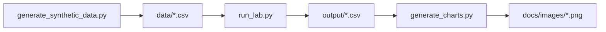

# Dagster Asset Pipeline Lab

**Author:** [Faiz Elahi](https://github.com/faizilahi) (`faizilahi`) · **Type:** EDUCATIONAL LAB · **Synthetic data only**

---

## Educational disclaimer

This is an **educational portfolio lab**. Datasets are **synthetic**. It does **not** claim employment at a customer, hospital, bank, SAP shop, or Oracle estate. No real PHI/PII. No live cloud spend. No API keys required.

---

## Problem statement

Teams want asset-oriented pipelines (raw → staged → mart) with explicit dependencies rather than only task DAGs.

**Domain focus:** Warehouse asset lineage

---

## Why this tool (Dagster-style software-defined assets)

| Task-only DAGs | Asset lineage |
|---|---|
| Unclear freshness | Asset materialize timestamps |

---

## Architecture



See [`docs/architecture.md`](docs/architecture.md).

---

## Dataset dictionary

| Asset | Notes |
|------|-------|
| `raw_orders` | Landing |
| `staged_orders` | Cleaned |
| `mart_daily` | Gold |

---

## Prerequisites

- Python 3.10+
- Packages in `requirements.txt`

---

## How to run

```powershell
cd "dagster-asset-pipeline-lab"
python -m venv .venv
.\\.venv\Scripts\Activate.ps1
pip install -r requirements.txt
python scripts/generate_synthetic_data.py
python src/run_lab.py
python scripts/generate_charts.py
```

Inspect `output/summary.csv` and `docs/images/primary_metric.png`.

---

## Local vs cloud (honest)

Pure Python asset graph stand-in. No Dagster Cloud/Daemon required. Prefect/Airflow labs remain separate.

---

## Results interpretation

Open `output/` CSVs and the PNGs under `docs/images/`. Numbers are synthetic teaching fixtures — use them to explain grain, filters, and control totals, not as real business KPIs.

---

## Limitations

- Stand-in engines (DuckDB/SQLite/pandas) replace paid MPP/warehouses where noted.
- Simplified schemas vs production SAP/Oracle/Hive estates.
- Charts are matplotlib teaching visuals, not vendor BI embeds.

---

## Exercises

1. Add a partitioned asset by day.
2. Skip rematerialize when fingerprint unchanged.
3. Compare asset vs task mental models in docs.

---

## License / attribution

Educational portfolio content by Faiz Elahi. Synthetic data for teaching only.

